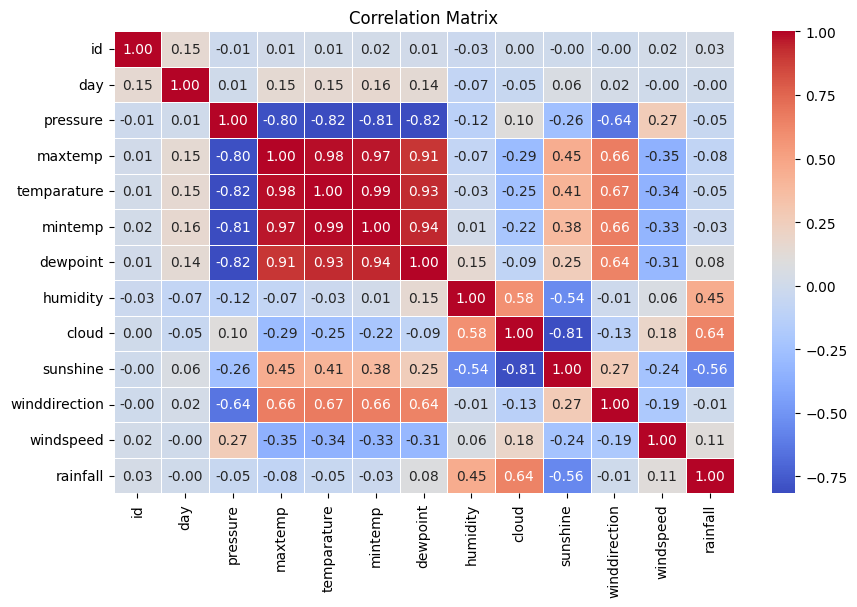
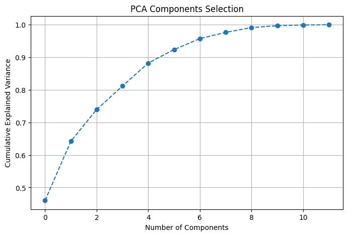
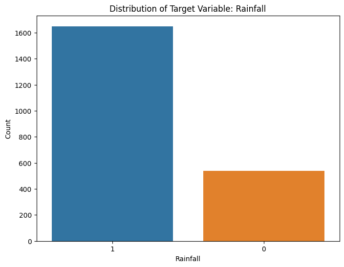

# 🌧️ Previsão de Chuva com Machine Learning: Insights da Competição Kaggle Playground Series S5E4

Hoje quero compartilhar o notebook que desenvolvi para a competição **Kaggle Playground Series S5E4**, cujo objetivo era prever a **probabilidade de chuva** com base em variáveis meteorológicas. Além de apresentar os insights e técnicas utilizadas, quero destacar por que cada passo foi crucial para o desempenho do modelo — e também refletir sobre o que aprendi durante o processo.

## O Problema
O dataset de treino continha **2.190 amostras** e **13 variáveis**, sendo a coluna **rainfall** o target (binário: 1 para chuva e 0 para não chuva). Os dados estavam bem organizados, sem valores faltantes no conjunto de teste, exceto por um único valor ausente no conjunto de treino, que foi facilmente imputado. Essa limpeza inicial simplificou o pré-processamento e permitiu focar diretamente na análise.

## 🔍 Exploração e Pré-Processamento
O notebook começa com visualizações das distribuições das variáveis. Gráficos de histograma ajudaram a identificar padrões, outliers e comportamentos específicos. A ausência de variáveis categóricas facilitou ainda mais o processamento dos dados.

Ao analisar a **matriz de correlação**, identifiquei quatro variáveis altamente correlacionadas, indicando **multicolinearidade**. Esse fenômeno pode prejudicar tanto o desempenho quanto a interpretabilidade do modelo. Para confirmar essa suspeita, calculei o **Fator de Inflação de Variância (VIF)**, que reforçou a necessidade de lidar com essas correlações.



Para padronizar os dados, apliquei o **StandardScaler**, garantindo que todas as variáveis estivessem na mesma escala. Em seguida, utilizei o **PCA (Principal Component Analysis)** para reduzir a dimensionalidade, capturando a maior parte da variância dos dados enquanto otimizava o tempo de treinamento e evitava overfitting. Após analisar o gráfico de variância acumulada explicada pelo PCA, decidi utilizar **6 componentes**, que representavam cerca de **95% da variação total** dos dados.



## ⚖️ Desafio do Desbalanceamento
Outro ponto importante foi o desbalanceamento do dataset: cerca de **75% das amostras pertenciam à classe "chuva" (1)**, enquanto apenas **25% eram da classe "não chuva" (0)**.



Para evitar que o modelo fosse enviesado em favor da classe majoritária, apliquei a técnica **SMOTE (Synthetic Minority Over-sampling Technique)** para balancear as classes. Após o balanceamento, reapliquei o **PCA com 6 componentes** para manter a consistência da redução de dimensionalidade.

## 🤖 Testando Modelos
Testei **8 algoritmos diferentes**, desde modelos clássicos como **Regressão Logística** e **Árvores de Decisão**, até métodos avançados como **XGBoost** e **LightGBM**. Utilizei a métrica **ROC-AUC** como principal indicador de desempenho e apliquei **validação cruzada estratificada**, garantindo uma avaliação robusta e preservando a proporção das classes em cada fold.

Entre todos os modelos testados, o **Random Forest Classifier** se destacou como o mais robusto e eficiente, apresentando:
- **ROC-AUC médio**: **0.9437** (o mais alto entre todos os modelos)
- **Desvio padrão**: **0.0075** (segunda menor variação entre os folds)

Com base nesses resultados, parti para o ajuste fino de hiperparâmetros utilizando **Grid Search**. Os melhores parâmetros encontrados foram:

```python
{'n_estimators': 200,
'min_samples_split': 2,
'min_samples_leaf': 1,
'max_features': 'sqrt',
'max_depth': None,
'bootstrap': True}
```

Esse ajuste resultou em um leve incremento no **ROC-AUC**, elevando-o para **0.9446**.

## 📊 Submissão e Reflexões Finais
Após todo o processo, treinei o modelo final com os parâmetros ajustados e submeti as previsões. Meu resultado final foi:
- **Private Score** (calculado no fim da competição utilizando completo): **0.83588**
- **Public Score** (calculado a cada submissão utilizando apenas 20% do dataset): **0.85800**

No entanto, ao final da competição, descobri algo surpreendente: o modelo que melhor performou com todos os dados disponíveis foi o **Logistic Regression**, utilizado como **baseline** inicial e sem nenhum ajuste de hiperparâmetros. Esse modelo alcançou:
- **Private Score**: **0.88138**
- **Public Score**: **0.84928**

Essa experiência me ensinou uma lição valiosa: nem sempre os modelos mais complexos são os melhores. Às vezes, soluções simples e robustas podem superar abordagens sofisticadas, especialmente quando os dados estão bem estruturados e as relações entre as variáveis são lineares ou quase lineares.

#MachineLearning #DataScience #Kaggle #AI #RainfallPrediction #PrevisãoClimática #AnaliseDeDados #AprendizadoDeMáquina #CienciaDeDados
